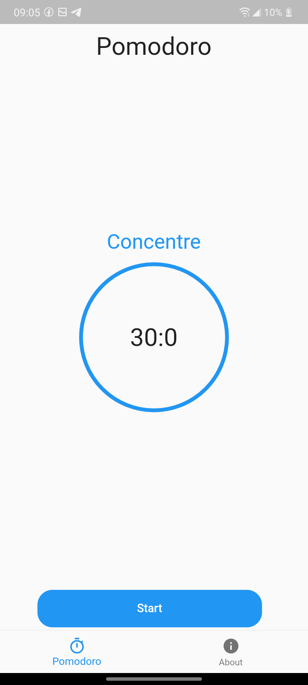
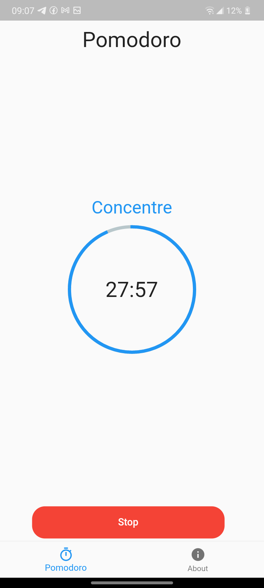
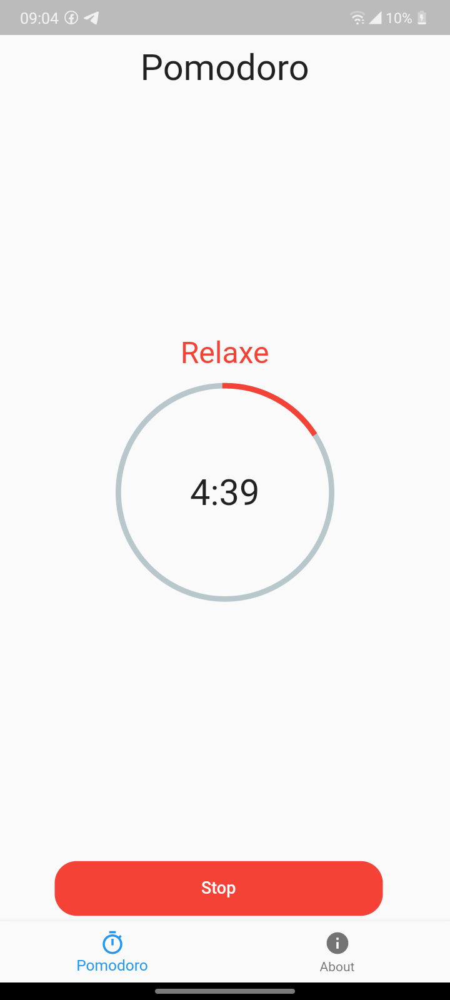
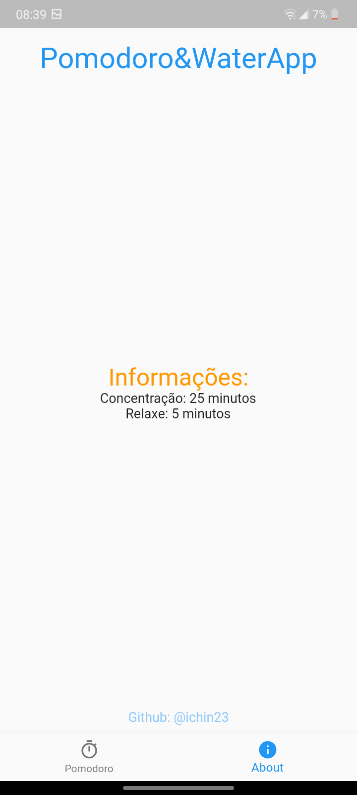

# Pomodoro

Meu App baseado na Tecnica Pomodoro, que consiste em 25 minutos de foco e 5 minutos de descanso.

<figure>

   <figcaption>Tela inicial do App</figcaption>
 </figure>
 
 <figure>

   <figcaption>Tela inicial do App enquanto executado</figcaption>
 </figure>

<figure>

   <figcaption>Tela inicial do App quando o tempo está em descanso</figcaption>
 </figure>
 
 <figure>

   <figcaption>Tela About do App</figcaption>
 </figure>
 
 O App também envia uma notificação a cada 30 minutos para lembrar de beber água.
